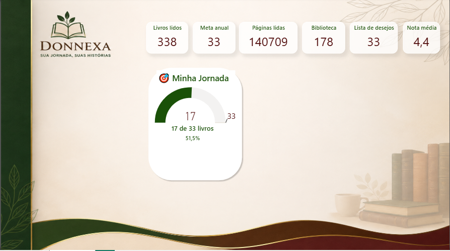

<div align="center">

# 📚 DONNEXA

### *Sua jornada, suas histórias.*


---

### Transformando dados em histórias.

Um ecossistema para leitores apaixonados, desenvolvido para organizar bibliotecas, acompanhar metas, analisar hábitos de leitura e, futuramente, conectar leitores em uma única plataforma.


</div>

---

# 🌿 Sobre o Projeto

O **Donnexa** nasceu de uma necessidade real.

Como leitora, eu sempre utilizei planilhas para controlar meus livros, metas anuais, páginas lidas, avaliações e listas de desejos.

Com o tempo percebi que apenas armazenar informações não era suficiente.

Eu queria entender meus hábitos de leitura.

Queria acompanhar meu progresso.

Queria transformar números em motivação.

Foi então que nasceu o Donnexa.

Inicialmente desenvolvido em **Power BI**, o projeto evoluirá para uma plataforma completa utilizando diferentes tecnologias ao longo da minha jornada como desenvolvedora.

Hoje ele é um Dashboard.

Amanhã será um Sistema.

---

# ✨ Objetivos

O Donnexa pretende oferecer uma experiência completa para leitores.

✔ Biblioteca pessoal

✔ Dashboard interativo

✔ Metas anuais

✔ Estatísticas de leitura

✔ Controle de páginas

✔ Lista de desejos

✔ Avaliações

✔ Planejamento de leitura

✔ Cronograma inteligente para leituras coletivas

✔ Recomendações

✔ Plataforma Web

✔ Aplicativo Mobile

---

# 📸 Dashboard

## Home

> *(Imagem será atualizada conforme evolução do projeto)*



---

# 🚀 Roadmap

## Fase 1 — Business Intelligence ✅

- Dashboard Home
- Indicadores principais
- Biblioteca
- Meta Anual
- Lista de Desejos
- DAX
- Power Query
- Modelagem Dimensional

---

## Fase 2 — Banco de Dados

- SQL Server
- Modelagem Relacional
- Procedures
- Views
- Triggers
- ETL

---

## Fase 3 — Python

- Automações
- Tratamento de dados
- API
- Web Scraping
- Recomendações
- Machine Learning (futuro)

---

## Fase 4 — Desenvolvimento Web

- Backend
- Frontend
- Login
- Biblioteca Online
- Perfil do Leitor

---

## Fase 5 — Aplicativo Mobile

- Android
- iOS
- Sincronização
- Notificações
- Leitura Offline

---

# 💡 Funcionalidade Principal (Futuro)

## 📖 Cronograma Inteligente de Leitura

Esta é a funcionalidade que mais me motiva neste projeto.

Hoje leitores que participam de leituras coletivas precisam dividir manualmente um livro em metas diárias.

É um processo demorado.

O Donnexa fará isso automaticamente.

Bastará informar:

- Livro
- Quantidade de páginas por dia
- Data de início

O sistema calculará automaticamente:

- capítulos
- páginas
- datas
- cronograma completo

Permitindo compartilhar o planejamento com todo o grupo em poucos segundos.

---

# 🛠 Tecnologias

### Atualmente

- Power BI
- DAX
- Power Query
- Excel
- Git
- GitHub

### Em estudo

- SQL Server
- Python
- HTML
- CSS
- JavaScript

### Futuramente

- React
- FastAPI
- PostgreSQL
- Docker
- Azure

---

# 📂 Estrutura

```text
Donnexa
│
├── assets
│
├── dashboard
│
├── data
│
├── docs
│
└── README.md
```

---

# 🎯 Minha Jornada

O Donnexa também representa minha evolução como profissional.

Cada nova tecnologia que aprender será incorporada ao projeto.

Assim, o repositório contará a história do meu crescimento em:

- Business Intelligence
- Banco de Dados
- Ciência de Dados
- Desenvolvimento Web
- Desenvolvimento Mobile

---

# ❤️ Filosofia

> "Os livros contam histórias.
>
> O Donnexa conta a história do leitor."

---

# 👩‍💻 Desenvolvido por

**Médonne Penteado**

Estudante de Análise e Desenvolvimento de Sistemas

Em constante aprendizado.

---

# 📄 Licença

MIT License
# Donnexa

